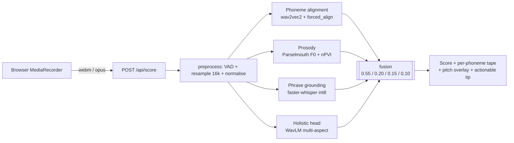
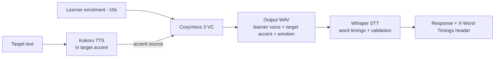
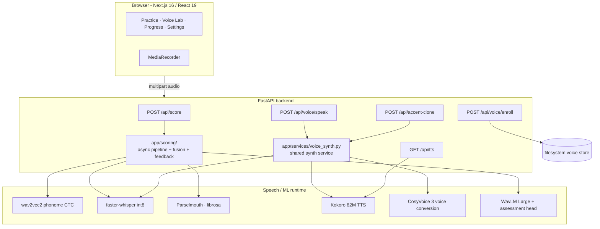

# PronounceAI

> A pronunciation coach that hears every phoneme, sees every pitch curve, and renders your own voice in the accent you want to master.

[](backend/tests)
[](backend/requirements.prod.txt)
[](frontend/package.json)
[](LICENSE)

---

## Hear it before you read about it

A learner's enrolled voice, then the same speaker rendered in a long American-English sentence they never recorded — produced by the pipeline in this repository.

**Their natural voice (enrolment recording)**

https://github.com/vikranthreddimasu/PronounceAI/releases/download/samples-v1/voice_user_original.mp4

> *"Hello, my name is Alex. The quick brown fox jumps over the lazy dog by the river…"*

**Their voice — rendered by PronounceAI in General American**

https://github.com/vikranthreddimasu/PronounceAI/releases/download/samples-v1/voice_user_clone_ga.mp4

> *"The renewable energy transition will define the next half-century, and the engineers who solve the storage problem will reshape every industry from agriculture to artificial intelligence."*

Identity preserved. New sentence. Target accent locked in.

---

## Why

Most pronunciation tools grade speech with one opaque number, then tell you to *try again*. Two beliefs change the design:

1. **Feedback should point at the sound, not at the speaker.** When a learner's `/r/` drifts toward `/l/`, the system should say so — at the millisecond it happened.
2. **The learner's voice is theirs.** Accent practice shouldn't replace their timbre with a generic native speaker's; it should render the same words in the target accent with the speaker still recognisably themselves.

---

## How

One audio recording fans out across four independent, explainable signals. Nothing silently overrides anything else.



| Signal | Answers |
| --- | --- |
| **Phoneme alignment** (wav2vec2 + CTC forced alignment) | Where in time did each phone happen? How confident is the model you produced it? (GOP log-prob.) |
| **Prosody** (Parselmouth · librosa) | Did your pitch contour move like a native speaker's? Was your timing stress-timed or syllable-timed? (nPVI.) |
| **Phrase grounding** (faster-whisper int8) | Did you actually say the right words? Surfaced as a discrete `phrase_match_status`, not a silent cap on the score. |
| **Holistic head** (WavLM multi-aspect, optional) | A learned second opinion calibrated against speechocean762 human ratings. Bounded blend weight when its checkpoint is loaded. |

The score on screen is a transparent sum:

```
overall = 0.55 · phoneme_accuracy
        + 0.20 · intonation
        + 0.15 · stress_rhythm
        + 0.10 · vowel_quality
```

For voice cloning we picked **one** pipeline (no fallback chain): CosyVoice 3 voice conversion, with the target-accent source rendered by Kokoro TTS. Accent stays deterministic. Speaker identity stays the learner's.



---

## What you get

### 1 · Voice cloning across emotions and accents

CosyVoice 3 voice conversion. The learner records once; every clip below is generated from that single enrolment.

**Happy · General American**
> *"I just got promoted today. I am so excited for the future!"*

https://github.com/vikranthreddimasu/PronounceAI/releases/download/samples-v1/voice_happy_ga.mp4

**Sad · Received Pronunciation**
> *"The old photograph brought back so many precious memories."*

https://github.com/vikranthreddimasu/PronounceAI/releases/download/samples-v1/voice_sad_rp.mp4

**Angry · General American**
> *"This is completely unacceptable. I demand to speak to the manager."*

https://github.com/vikranthreddimasu/PronounceAI/releases/download/samples-v1/voice_angry_ga.mp4

**Calm · Received Pronunciation**
> *"Close your eyes. Breathe in slowly. Let the tension fade away."*

https://github.com/vikranthreddimasu/PronounceAI/releases/download/samples-v1/voice_calm_rp.mp4

**Whisper · General American**
> *"I need to tell you a secret, but you must promise not to tell anyone."*

https://github.com/vikranthreddimasu/PronounceAI/releases/download/samples-v1/voice_whisper_ga.mp4

### 2 · Pronunciation scoring

Three score JSON fixtures are committed so the response shape is inspectable without running the server:

| Phrase · Accent | Overall | Phrase match | JSON | Native reference |
| --- | :-: | :-: | --- | --- |
| "Ship or sheep?" · GA | **84.5** | `ok` | [json](docs/samples/score_ga_ship_or_sheep.json) | [mp4](https://github.com/vikranthreddimasu/PronounceAI/releases/download/samples-v1/tts_ga_ship_or_sheep.mp4) |
| "She sells seashells by the seashore." · GA | **92.4** | `ok` | [json](docs/samples/score_ga_seashells.json) | [mp4](https://github.com/vikranthreddimasu/PronounceAI/releases/download/samples-v1/tts_ga_seashells.mp4) |
| "The quick brown fox jumps over the lazy dog." · RP | **92.3** | `ok` | [json](docs/samples/score_rp_quick_brown_fox_rp.json) | [mp4](https://github.com/vikranthreddimasu/PronounceAI/releases/download/samples-v1/tts_ga_quick_brown_fox.mp4) |

Each fixture carries per-phoneme GOP with timestamps, the four scoring dimensions, the discrete `phrase_match_status`, the pitch overlay, and a `debug` block exposing weights and raw scores.

**Quick listen — "She sells seashells by the seashore." in General American**

https://github.com/vikranthreddimasu/PronounceAI/releases/download/samples-v1/tts_ga_seashells.mp4

### 3 · The product UI

| Route | What it does |
| --- | --- |
| `/practice` | Phrase library + free-text recording → score + per-phoneme tape + pitch overlay + actionable tip. |
| `/studio` | Voice Lab — enrol, manage takes, type text, render in your voice + chosen accent + emotion. |
| `/progress` | Local session history, streak, per-phoneme mastery (`localStorage`, no accounts). |
| `/settings` | Target accent, theme, sound effects, profile reset. |

---

## Run it

**Docker (reviewer path)**

```bash
docker compose up --build
# UI: http://localhost:3000  ·  API: http://localhost:8000
```

**Local (Apple Silicon, full feature set)**

```bash
# Backend
cd backend && ./setup.sh && source .venv/bin/activate
uvicorn app.main:app --reload --port 8000

# Frontend (new terminal)
cd frontend && npm install
NEXT_PUBLIC_API_URL=http://127.0.0.1:8000 npm run dev
```

CosyVoice voice cloning needs `mlx-audio-plus` (Apple Silicon only). On other platforms the system falls back to Kokoro TTS in the requested accent.

**Regenerate the README samples**

```bash
cd backend && source .venv/bin/activate
python scripts/generate_readme_samples.py     # idempotent; needs ffmpeg on PATH
```

---

## System architecture



Key design decisions live in [docs/REDESIGN_PLAN.md](docs/REDESIGN_PLAN.md). API contracts in [API.md](API.md). Stable container runbook in [docs/DEPLOYMENT.md](docs/DEPLOYMENT.md).

---

## What's inside

```
backend/app/
├── main.py             FastAPI lifespan + CORS + router wiring
├── api/                thin HTTP routers (score · tts · voice_enroll · accent_clone)
├── scoring/            async pipeline · fusion · pitch_contour · vowel_quality · feedback
├── services/           voice_synth — shared by /voice/speak and /accent-clone
├── models/             phoneme · prosody · whisper · voice_clone · assessment_scorer · emotion · phonology
├── cache/              shared LRU + atomic disk cache (tmp+rename, TTL)
└── utils/              audio preprocess · kokoro_speaker · voice_store · native_pitch · text_metrics

backend/training/       speechocean762 + WavLM head training utilities
backend/tests/          pytest, no network (34 tests, all green)
docs/samples/           audio + JSON fixtures the README links to
frontend/src/           App Router pages + practice/voice UI + API client
```

---

## Tests + CI

```bash
cd backend && pytest tests/ -q          # 34 tests
cd frontend && npx tsc --noEmit && npm run build
```

Manifest-driven evaluation against recorded fixtures:

```bash
cd backend && python -m evaluation.evaluate_score_api --manifest evaluation/score_manifest.jsonl
```

---

## License

[MIT](LICENSE).
