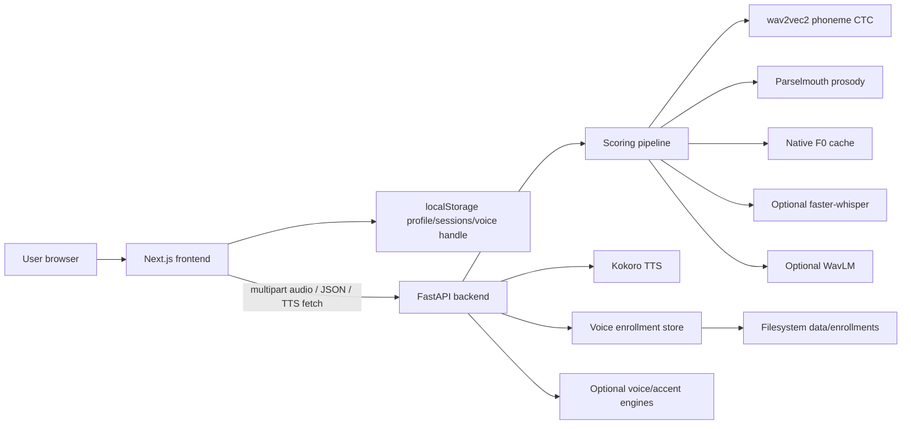
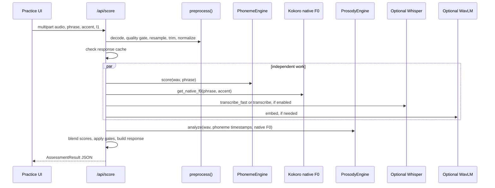

# PronounceAI Technical Report

## 1. Scope And Evidence

This report documents the implemented PronounceAI repository as inspected from source code, configuration files, tests, and local documentation. It intentionally focuses on stable local development and reproducible execution.

Production hosting details are excluded because the current hosted deployment path is evolving. The stable container story is the local Docker/Compose workflow in `docker-compose.yml`, `backend/Dockerfile`, `frontend/Dockerfile`, and `docs/DEPLOYMENT.md`.

Terminology used in this report:

- **Confirmed implementation** means the behavior is present in the current codebase.
- **Optional implementation** means code exists, but it depends on environment flags, checkpoints, external downloads, or non-default dependencies.
- **Design note only** means the concept appears in planning documentation but is not implemented as a runtime path.

## 2. Executive Summary

PronounceAI is a full-stack English pronunciation and accent coaching system. The frontend is a Next.js App Router application with browser audio capture, local progress state, voice profile controls, and demo-mode fallbacks. The backend is a FastAPI service that loads speech models during application lifespan and exposes scoring, TTS, accent conversion, and voice enrollment endpoints.

The strongest implemented subsystem is the `/api/score` pipeline. It performs audio preprocessing, CTC phoneme alignment, GOP scoring, deterministic prosody analysis, native pitch comparison through Kokoro-generated reference speech, optional Whisper transcript grounding, optional WavLM embeddings, and optional learned assessment blending.

The project does **not** currently implement server-side accounts, database-backed session history, LLM-generated coaching, textual retrieval/RAG, Redis, Postgres, or production-grade cloud orchestration. Session history and profile settings live in the browser. Voice enrollment audio lives on the backend filesystem under an opaque browser-generated user ID.

## 3. Repository Map

```text
PronounceAI/
|-- README.md
|-- report.md
|-- API.md
|-- docker-compose.yml
|-- docs/
|   |-- DEPLOYMENT.md
|   `-- REDESIGN_PLAN.md
|-- backend/
|   |-- Dockerfile
|   |-- requirements.txt
|   |-- requirements.prod.txt
|   |-- setup.sh
|   |-- app/
|   |   |-- main.py
|   |   |-- api/
|   |   |   |-- score.py
|   |   |   |-- tts.py
|   |   |   |-- accent_convert.py
|   |   |   |-- accent_clone.py
|   |   |   `-- voice_enroll.py
|   |   |-- models/
|   |   |   |-- phoneme_engine.py
|   |   |   |-- prosody_engine.py
|   |   |   |-- assessment_scorer.py
|   |   |   |-- accent_distance.py
|   |   |   |-- accent_converter.py
|   |   |   |-- whisper_engine.py
|   |   |   |-- voice_clone.py
|   |   |   |-- emotion_detector.py
|   |   |   `-- phonology.py
|   |   `-- utils/
|   |       |-- audio.py
|   |       |-- native_pitch.py
|   |       |-- text_metrics.py
|   |       `-- voice_store.py
|   |-- training/
|   |-- evaluation/
|   |-- scripts/
|   |-- tests/
|   |-- checkpoints/
|   |-- data/
|   `-- models/
`-- frontend/
    |-- Dockerfile
    |-- package.json
    |-- next.config.ts
    `-- src/
        |-- app/
        |-- components/
        `-- lib/
```

Important repository hygiene findings:

- `backend/data/` and `backend/checkpoints/` contain local runtime/training artifacts in the working tree, but those paths are gitignored.
- `backend/checkpoints/.gitkeep` is the only tracked checkpoint file.
- Runtime checkpoints such as `phoneme_scorer_best.pt` and `assessment_head_best.pt` are optional and are not guaranteed in a clean clone.
- `docs/REDESIGN_PLAN.md` contains aspirational architecture. This report does not treat it as implemented behavior unless code confirms it.

## 4. System Architecture

### 4.1 High-Level Runtime



The architecture is intentionally two-process:

- **Frontend process:** Next.js serves UI and client JavaScript.
- **Backend process:** FastAPI hosts long-lived speech model objects.

The backend is not designed for serverless execution because model load times, PyTorch memory, local caches, and enrollment files all benefit from a persistent process.

### 4.2 Stable Local Architecture

The stable architecture for review is local:

- Frontend: `http://localhost:3000`
- Backend: `http://localhost:8000`
- CORS: `CORS_ORIGINS=http://localhost:3000`
- Storage: browser localStorage plus backend filesystem directories
- Model cache: Hugging Face and Kokoro downloads under local or Docker cache paths

## 5. Frontend Architecture

### 5.1 Framework And Routing

Confirmed implementation:

- Framework: Next.js 16 with React 19 and TypeScript.
- Routing: App Router under `frontend/src/app`.
- Global shell: `layout.tsx` imports `globals.css`, `NavBar`, and `ThemeBoot`.
- Home route: `/` redirects to `/studio`.

Routes:

| Route | File | Purpose |
| --- | --- | --- |
| `/studio` | `src/app/studio/page.tsx` | Voice Lab entry point. |
| `/practice` | `src/app/practice/page.tsx` | Recording, scoring, review workflow. |
| `/progress` | `src/app/progress/page.tsx` | Local session and phoneme progress. |
| `/settings` | `src/app/settings/page.tsx` | Profile, target accent, L1, voice, theme, sounds, reset. |
| `/library` | `src/app/library/page.tsx` | Redirects to `/practice`. |
| `/history` | `src/app/history/page.tsx` | Redirects to `/progress`. |

### 5.2 User-Facing Workflows

#### Voice Lab

Implemented in `frontend/src/components/VoiceStudio.tsx`.

The Voice Lab flow:

1. Reads target accent from local profile.
2. Checks voice profile through `useVoiceSession`.
3. Lets the user write up to 400 characters.
4. Lets the user choose GA or RP.
5. Lets the user choose render mode:
   - `target_accent`: prioritize requested target accent.
   - `natural`: preserve enrolled voice/accent more strongly.
6. Lets the user choose emotion, including `auto`.
7. Calls `speakInVoice` in `frontend/src/lib/voiceProfile.ts`.
8. Receives audio plus optional word timings from backend response headers.
9. Plays the generated clip and stores recent clip requests in localStorage.

Voice Lab state is local React state plus browser localStorage for recent clips.

#### Practice

Implemented in `frontend/src/app/practice/page.tsx`.

The practice flow:

1. Loads a shuffled phrase list from `frontend/src/lib/phrases.ts`.
2. Allows phrase selection or custom text entry.
3. Persists target accent changes to the local profile.
4. Prefetches target TTS and prewarms backend scoring context.
5. Uses `createRecorder` to capture browser audio.
6. Sends the Blob to `scoreRecording`.
7. Stores the resulting session through `appendSession`.
8. Renders score bars, phoneme timeline, A/B phoneme comparison, transcript data, and pitch contour overlays.

The route uses cancellation aggressively:

- Abort previous scoring when a new recording starts.
- Abort target playback when phrase/accent changes.
- Clean up object URLs on unmount.

#### Progress

Implemented in `frontend/src/app/progress/page.tsx`.

Progress is derived entirely from localStorage:

- Recent sessions.
- Average score.
- Streak.
- Per-phoneme mastery queue.
- Last 30 score trend chart.

There is no backend read for progress.

#### Settings

Implemented in `frontend/src/app/settings/page.tsx`.

Settings controls:

- Target accent: GA or RP.
- Native language hint: stored locally and sent to scoring as `l1`.
- Voice enrollment management.
- Theme: light, dark, system.
- WebAudio micro-sounds.
- Local reset and voice profile deletion.

### 5.3 State Management

Confirmed implementation:

The app uses custom localStorage helpers in `frontend/src/lib/store.ts`, not Redux, Zustand, or server session state.

Storage keys:

| Key | Contents |
| --- | --- |
| `pronounceai.profile.v1` | L1, target accent, theme, onboarding flag. |
| `pronounceai.sessions.v1` | Completed assessment summaries, capped at 200. |
| `pronounceai.phonemes.v1` | Per-phoneme attempt count and average GOP. |
| `pronounceai.streak.v1` | Current and longest daily streak. |
| `pronounceai.voice_id` | Opaque client-generated voice enrollment ID. |
| `pronounceai.studio.history.v1` | Recent Voice Lab clip requests. |
| `pronounceai.sounds.v1` | Sound effects preference. |

`subscribeStorage` and custom browser events keep React views synchronized after local mutations.

### 5.4 API Client And Mock Mode

Implemented in `frontend/src/lib/api.ts` and `frontend/src/lib/voiceProfile.ts`.

Mock mode is active when:

- `NEXT_PUBLIC_API_URL` is missing or empty, or
- `NEXT_PUBLIC_USE_MOCK=1`.

Mock behavior:

- `scoreRecording` returns generated mock assessment results.
- Reference playback falls back to browser Speech Synthesis.
- Accent conversion and voice synthesis throw live-backend-required errors.

Live API helpers:

| Helper | Endpoint |
| --- | --- |
| `scoreRecording` | `POST /api/score` |
| `playNativeAudio`, `prepareNativeAudio`, `prefetchNativeAudio` | `GET /api/tts` |
| `prewarmPhrase` | `POST /api/prewarm` |
| `convertAccent` | `POST /api/accent-convert` |
| `fetchVoiceProfile` | `GET /api/voice/{user_id}` |
| `addVoiceTake` | `POST /api/voice/enroll` |
| `speakInVoice` | `POST /api/voice/speak` |
| `cloneAccent` | `POST /api/accent-clone` |

Frontend caches:

- Native TTS Blob cache, LRU-style max 16.
- Accent conversion cache keyed by Blob and accent through `WeakMap`.
- Voice clip cache, max 8, keyed by user ID, revision, accent, render mode, emotion, and text.

### 5.5 Browser Audio Capture

Implemented in `frontend/src/lib/recorder.ts`.

Confirmed implementation:

- Uses `navigator.mediaDevices.getUserMedia`.
- Uses `MediaRecorder`.
- Preferred MIME types:
  - `audio/webm;codecs=opus`
  - `audio/webm`
  - `audio/ogg;codecs=opus`
  - `audio/mp4`
- Enables echo cancellation, noise suppression, and auto gain control.
- Uses WebAudio `AnalyserNode` to expose RMS-like level data.
- Provides cleanup through `dispose`.

## 6. Backend Architecture

### 6.1 FastAPI Application Lifecycle

Implemented in `backend/app/main.py`.

Startup behavior:

1. Loads `.env.local` with override.
2. Loads `.env.example` as defaults.
3. Configures CORS from `CORS_ORIGINS`.
4. Configures espeak-ng library path for phonemizer when available.
5. Creates a FastAPI app with lifespan manager.
6. Loads model/service objects into `app.state`.
7. Includes routers under `/api`.

Loaded or initialized objects:

| `app.state` field | Status | Source |
| --- | --- | --- |
| `phoneme_engine` | Always attempted | `PhonemeEngine` |
| `prosody_engine` | Always loaded | `ProsodyEngine` |
| `assessment_scorer` | Optional checkpoint | `AssessmentScorer` |
| `accent_engine` | Optional WavLM/centroids/checkpoint | `AccentDistanceEngine` |
| `whisper` | Controlled by `LOAD_WHISPER` | `WhisperEngine` |
| `accent_converter` | Lazy or preloaded | `AccentConverter` |
| `voice_clone` | Controlled by `LOAD_VOICE_CLONE` | `VoiceClone` |
| `emotion_detector` | Lazy model wrapper | `EmotionDetector` |

### 6.2 API Surface

| Method | Path | Route file | Purpose |
| --- | --- | --- | --- |
| `GET` | `/health` | `main.py` | Health check. |
| `POST` | `/api/score` | `score.py` | Pronunciation assessment. |
| `POST` | `/api/prewarm` | `score.py` | Warm phrase/native F0 caches. |
| `GET` | `/api/tts` | `tts.py` | Kokoro WAV reference. |
| `POST` | `/api/accent-convert` | `accent_convert.py` | kNN-VC target accent conversion. |
| `POST` | `/api/accent-clone` | `accent_clone.py` | Personal accent clone or Kokoro fallback. |
| `POST` | `/api/voice/enroll` | `voice_enroll.py` | Add enrollment take. |
| `GET` | `/api/voice/{user_id}` | `voice_enroll.py` | Fetch voice profile summary. |
| `DELETE` | `/api/voice/{user_id}` | `voice_enroll.py` | Delete voice profile. |
| `DELETE` | `/api/voice/{user_id}/takes/{take_id}` | `voice_enroll.py` | Delete one take. |
| `POST` | `/api/voice/speak` | `voice_enroll.py` | Synthesize text in voice workflow. |

## 7. End-To-End Scoring Workflow

### 7.1 Data Flow



### 7.2 Audio Preprocessing

Implemented in `backend/app/utils/audio.py`.

Pipeline:

1. Decode audio bytes.
   - First tries `torchaudio.load(..., backend="ffmpeg")`.
   - Falls back to default torchaudio.
   - Falls back to subprocess FFmpeg into WAV.
2. Convert stereo/multi-channel audio to mono.
3. Run quality gate:
   - minimum duration: 0.5 seconds
   - maximum duration: 30 seconds
   - clipping check: more than 1 percent of samples above 0.98 fails
   - SNR estimate from first 0.2 seconds
4. Resample to 16 kHz.
5. Trim leading silence using short-window RMS.
6. Peak-normalize to 0.95.

Failure behavior:

- Quality failures raise `AudioError` and route responses use status 422.
- Decode failures generally map to status 400.

### 7.3 Phoneme Alignment And GOP Scoring

Implemented in `backend/app/models/phoneme_engine.py`.

Confirmed implementation:

- Loads `AutoProcessor` and `AutoModelForCTC`.
- Default model: `slplab/wav2vec2-large-robust-L2-english-phoneme-recognition`.
- Converts expected phrase text to ARPAbet phones using `g2p-en`.
- Strips stress digits from ARPAbet tokens.
- Maps phone tokens to model vocabulary IDs.
- Computes CTC logits and log probabilities.
- Runs `torchaudio.functional.forced_align` on CPU.
- Parses frame alignments into phoneme segments.
- Computes GOP as mean log probability for the expected phone over segment frames.
- Detects substitutions by comparing segment argmax token to expected token.
- Produces timestamped `PhonemeResult` objects.

Fallbacks:

- If `g2p-en` fails, it tries the model tokenizer.
- If forced alignment fails, it uses uniform segmentation.
- If no learned checkpoint exists, GOP is mapped directly to 0-100 scores.

Thresholds:

| GOP range | Label in code/UI |
| --- | --- |
| `> -1.0` | correct |
| `-2.0` to `-1.0` | marginal |
| `< -2.0` | incorrect |

The optional phoneme scorer checkpoint is loaded from `PHONEME_SCORER_CHECKPOINT`.

### 7.4 Alignment-Independent CTC Diagnostic

`PhonemeEngine._ctc_diagnostics` performs a greedy CTC collapse independent of forced alignment. This matters because forced alignment is constrained to the expected phone sequence and can hide insertions/deletions.

The diagnostic calculates:

- expected phone count
- predicted phone count
- phone error rate
- CTC sequence score
- predicted phones

`score.py` uses this diagnostic to cap phoneme accuracy:

- phone error rate >= 0.65 caps phoneme accuracy at 60.
- phone error rate >= 0.45 caps phoneme accuracy at 75.

### 7.5 Prosody Analysis

Implemented in `backend/app/models/prosody_engine.py`.

Inputs:

- 16 kHz user waveform.
- Phoneme timestamps from the phoneme engine.
- Optional native reference F0 contour.
- `include_formants` flag.

Outputs:

- `intonation`
- `stress_rhythm`
- `rate_score`
- `npvi`
- `f0_contour`
- `formants`
- `speech_rate_sps`

Methods:

- F0 extraction via Parselmouth/Praat.
- Fallback F0 extraction through librosa `pyin`.
- Intonation score through DTW against reference F0 when available.
- Internal smoothness proxy when reference F0 is unavailable.
- Rhythm score through normalized Pairwise Variability Index over vowel durations.
- Speech rate through vowel count over clip duration.
- Optional formants through Praat Burg formant extraction at vowel midpoints.

### 7.6 Native Pitch Reference

Implemented in `backend/app/utils/native_pitch.py`.

Pipeline:

1. Synthesize target phrase with Kokoro using the same accent voice mapping as `/api/tts`.
2. Resample Kokoro output from 24 kHz to 16 kHz.
3. Extract F0 with the same `ProsodyEngine`.
4. Return F0 array and synthesized duration.

Caching:

- In-memory cache keyed by normalized text, accent, and speed.
- Optional disk cache under `NATIVE_F0_CACHE_DIR`, default `cache/native_f0`.
- Disk cache stores compressed `.npz` files.

### 7.7 Transcript Grounding

Implemented in `backend/app/models/whisper_engine.py` and `backend/app/utils/text_metrics.py`.

Optional runtime:

- Controlled by `LOAD_WHISPER`.
- `SCORE_ASR_MODE=off` disables transcript work.
- `SCORE_ASR_MODE=fast` uses greedy text-only decoding.
- `SCORE_ASR_MODE=words` or `SCORE_WORD_TIMESTAMPS=1` asks for word timestamps.

Text metrics:

- punctuation/case normalization
- small number normalization from 0 to 20
- word error rate
- character similarity
- word coverage
- combined `phrase_match` score

Overall score gates:

- phrase match < 45 caps overall at 55.
- phrase match < 65 caps overall at 70.
- phrase match < 78 caps overall at 85.

### 7.8 Optional WavLM And Learned Assessment

Implemented in:

- `backend/app/models/accent_distance.py`
- `backend/app/models/assessment_scorer.py`

WavLM embedding path:

- Loads `microsoft/wavlm-large` by default.
- Mean-pools hidden states into an utterance embedding.
- Compares embedding against accent centroids when present.
- Caches embeddings by audio digest in `/api/score`.

Learned assessment head:

- Loads `assessment_head_best.pt` when present.
- Concatenates WavLM embedding with 12 acoustic features.
- Predicts `accuracy`, `fluency`, `prosody`, `completeness`, and `overall`.
- Blends learned predictions conservatively with deterministic scores:
  - learned accuracy into `phoneme_accuracy`
  - learned prosody into `intonation`
  - learned fluency into `stress_rhythm`
  - learned overall into final overall

Confirmed limitation:

- WavLM is skipped when `SCORE_WAVLM_MODE=off`.
- Accent centroids are optional and absent from a clean tracked checkout.

### 7.9 Final Score Composition

Deterministic score weights in `score.py`:

| Dimension | Weight |
| --- | --- |
| phoneme accuracy | 35 percent |
| intonation | 20 percent |
| stress/rhythm | 15 percent |
| vowel quality | 30 percent |

Vowel quality:

- Uses accent-specific F1/F2 target norms for GA or RP.
- Falls back to 70 when formants are unavailable.
- Docker/default demo settings usually leave formants off for speed.

## 8. Voice Systems

### 8.1 Voice Enrollment Store

Implemented in `backend/app/utils/voice_store.py`.

Storage layout:

```text
data/enrollments/{user_id}/
|-- take_001.wav
|-- take_002.wav
|-- meta.json
|-- bundle.wav
`-- bundle.json
```

Confirmed behavior:

- `user_id` must match `^[A-Za-z0-9_-]{8,64}$`.
- Takes are 16 kHz mono PCM files.
- Valid take duration after conditioning must be 4 to 25 seconds.
- Audio is checked for clipping and quiet RMS.
- Audio is DC-centered, silence-trimmed, loudness-normalized, and faded.
- Bundle is built lazily on read.
- Bundle is resampled to 24 kHz and capped at 28 seconds.
- Best-quality takes are selected by RMS, peak headroom, duration, and slight recency.
- Public API responses strip local filesystem paths.

### 8.2 Voice Speak Endpoint

Implemented in `backend/app/api/voice_enroll.py`.

`POST /api/voice/speak` requires:

- `user_id`
- `text`
- `accent`
- `strategy`
- `emotion`

Behavior:

- Validates text length, max 400 characters.
- Validates enrollment exists.
- If `voice_clone` is available, calls `VoiceClone.speak`.
- If `voice_clone` is unavailable, returns Kokoro fallback audio.
- Returns audio/wav.
- Returns word timings in base64 JSON header `X-Word-Timings`.
- Exposes custom headers for browser clients.

### 8.3 Voice Clone Engine

Implemented in `backend/app/models/voice_clone.py`.

Optional implementation:

- Default model: `mlx-community/Fun-CosyVoice3-0.5B-2512-fp16`.
- This path depends on `mlx_audio.tts.generate`.
- Docker defaults keep it disabled because the portable CPU container does not install the Apple Silicon oriented voice clone stack.

Implemented strategies:

| Strategy | Order |
| --- | --- |
| `target_accent` | voice conversion first, then instruct fallback by default |
| `natural` | zero-shot first, then instruct, then VC by default |

Modes:

- **VC:** synthesize target accent source with Kokoro, then voice-convert to enrolled timbre.
- **Zero-shot:** use reference audio and text directly.
- **Instruct:** use short style tags such as "American accent." or "British accent."

Validation:

- Optional Whisper transcription of synthesized output.
- Word coverage threshold.
- Length ratio threshold.
- Character sequence similarity threshold.
- Instruct prompt leak detection.

### 8.4 Emotion Detection

Implemented in `backend/app/models/emotion_detector.py`.

Optional behavior:

- Uses `j-hartmann/emotion-english-distilroberta-base`.
- Loaded lazily on first `detect()` call.
- Maps model labels into voice emotion keys:
  - anger/disgust -> angry
  - fear -> whisper
  - joy -> happy
  - neutral -> neutral
  - sadness -> sad
  - surprise -> excited
- Falls back to neutral below confidence threshold or on failure.

### 8.5 Accent Conversion

Implemented in `backend/app/models/accent_converter.py` and `backend/app/api/accent_convert.py`.

Optional implementation:

- Uses kNN-VC through `torch.hub.load("bshall/knn-vc", "knn_vc")`.
- Extracts WavLM features from user audio.
- Replaces frames with nearest neighbors from a target-accent reference pool.
- Decodes through the model's vocoder.
- Currently supports GA and RP in the converter map.

Reference pools:

- Stored as `checkpoints/accent_refs_{accent}.pt`.
- Built on demand from Kokoro phrases if missing.
- Can be built from VCTK through `backend/scripts/build_vctk_pool.py`.

## 9. NLP And Feedback Logic

### 9.1 Text Normalization

Implemented in `backend/app/utils/text_metrics.py`.

The backend uses deterministic text normalization:

- lowercase
- punctuation stripping
- apostrophe handling
- small numeric token normalization
- whitespace collapse

This is used for transcript validation and phrase matching.

### 9.2 Phonological Diagnostics

Implemented in `backend/app/models/phonology.py`.

The module defines a compact ARPAbet feature inventory:

- manner
- place
- voicing
- vowel height
- vowel backness
- roundness
- length

`diagnose_substitution(predicted, expected)` compares feature bundles and returns:

- heard phone
- target phone
- primary changed feature
- all changed features
- short articulatory hint

The scoring route uses this to build feedback tips for the weakest substitutions.

### 9.3 Prompt Orchestration

Confirmed implementation:

- There is no OpenAI, Claude, or external LLM feedback generation in the runtime code.
- There is no prompt-retrieval system for scoring feedback.
- CosyVoice instruct mode uses short style tags for speech generation, but this is not a general LLM prompt orchestration layer.

Design note only:

- `docs/REDESIGN_PLAN.md` describes Claude-generated feedback and richer prompt orchestration. That plan is not implemented in the current backend.

## 10. Embeddings And Retrieval Systems

### 10.1 Speech Embeddings

Confirmed/optional implementation:

- WavLM embeddings are implemented for accent distance and learned assessment.
- Embeddings are mean-pooled hidden states.
- `/api/score` caches embeddings by audio digest.

### 10.2 Accent Centroid Retrieval

Optional implementation:

- `AccentDistanceEngine` loads centroids from `ACCENT_CENTROIDS_PATH`.
- It computes cosine similarity between user embedding and target accent centroid.
- It converts cosine similarity into a 0-100 score.

### 10.3 kNN-VC Reference Pools

Optional implementation:

- kNN-VC retrieves nearest-neighbor acoustic feature frames from target accent reference pools.
- Pool files live in `backend/checkpoints/`.
- Pools can be synthetic Kokoro pools or VCTK-derived pools.

### 10.4 Text Retrieval

Confirmed absence:

- No vector database.
- No text embeddings.
- No RAG pipeline.
- No semantic document retrieval.

## 11. Datasets And Training Pipelines

### 11.1 Implemented Datasets

Confirmed in scripts:

| Dataset/source | Used by | Purpose |
| --- | --- | --- |
| `jbpark0614/speechocean762` | `train_phoneme_scorer.py` | GOP calibration against utterance-level accuracy. |
| `jbpark0614/speechocean762` | `train_multitask_assessment.py` default | Multi-aspect WavLM assessment head. |
| VCTK Hugging Face dataset | `build_accent_centroids.py` | Optional WavLM accent centroids. |
| VCTK zip at `data/vctk/VCTK-Corpus-0.92.zip` | `scripts/build_vctk_pool.py` | Optional kNN-VC target-accent pools. |
| Browser enrollment audio | `voice_store.py` | User-specific voice reference bundle. |

Design note only:

- L2-ARCTIC appears in `docs/REDESIGN_PLAN.md`, but no current training script loads it.

### 11.2 Phoneme Scorer Training

Implemented in `backend/training/train_phoneme_scorer.py`.

Pipeline:

1. Load frozen wav2vec2 phoneme CTC backbone.
2. Load Speechocean train and test splits.
3. Resample audio to 16 kHz when needed.
4. Run CTC model.
5. Mean-pool log probabilities over frames into a GOP-like feature vector.
6. Train a small MLP regression head to predict utterance-level accuracy.
7. Save:
   - feature cache: `checkpoints/speechocean762_features.pt`
   - best checkpoint: `checkpoints/phoneme_scorer_best.pt`

Important limitation:

- The Hugging Face Speechocean upload used by this script provides utterance-level labels, not per-phoneme labels.

### 11.3 Multi-Aspect Assessment Training

Implemented in `backend/training/train_multitask_assessment.py`.

Pipeline:

1. Load labeled speech samples.
2. Extract or load WavLM embeddings.
3. Extract 12 compact acoustic features.
4. Concatenate embedding and acoustic features.
5. Train `MultiAspectHead`.
6. Use masked MSE so missing labels can be skipped per output dimension.
7. Save `checkpoints/assessment_head_best.pt`.

Outputs:

- accuracy
- fluency
- prosody
- completeness
- overall

### 11.4 Accent Centroid Builder

Implemented in `backend/training/build_accent_centroids.py`.

Pipeline:

1. Load WavLM.
2. Load VCTK dataset.
3. Select representative speakers per accent from a hardcoded mapping.
4. Embed up to 10 utterances per speaker.
5. Average embeddings.
6. L2-normalize the centroid.
7. Save `checkpoints/accent_centroids.pt`.

Important limitation:

- If VCTK loading fails, the script creates random placeholder centroids. These are useful for development shape checks, not for meaningful accent scoring.

### 11.5 kNN-VC VCTK Pool Builder

Implemented in `backend/scripts/build_vctk_pool.py`.

Pipeline:

1. Read VCTK FLAC files from a zip without full extraction.
2. Select hardcoded GA and RP-ish speaker groups.
3. Resample to 16 kHz.
4. Peak-normalize.
5. Extract kNN-VC features.
6. Concatenate and save `accent_refs_{accent}.pt`.

## 12. Caching And Performance Layers

### 12.1 Backend Caches

| Cache | File/module | Key | Purpose |
| --- | --- | --- | --- |
| Result LRU | `api/score.py` | audio digest, phrase, accent, L1, mode flags | Avoid repeated full scoring. |
| Transcript LRU | `api/score.py` | audio digest and ASR mode | Avoid repeated Whisper decode. |
| Embedding LRU | `api/score.py` | audio digest | Avoid repeated WavLM embedding. |
| Phrase token cache | `models/phoneme_engine.py` | normalized phrase | Avoid repeated G2P/token conversion. |
| TTS audio cache | `api/tts.py` | text, accent, speed | Avoid repeated Kokoro synthesis. |
| Native F0 memory cache | `utils/native_pitch.py` | text, accent, speed | Avoid repeated reference F0 extraction. |
| Native F0 disk cache | `utils/native_pitch.py` | hashed key | Persist reference F0 across restarts. |
| kNN-VC pool cache | `models/accent_converter.py` | accent and file mtime | Avoid repeated pool loads. |
| Voice bundle cache | `utils/voice_store.py` | bundle files on disk | Avoid rebuilding enrollment reference every request. |

### 12.2 Frontend Caches

| Cache | File | Purpose |
| --- | --- | --- |
| Native audio cache | `lib/api.ts` | Reuse TTS Blobs. |
| Accent conversion cache | `lib/api.ts` | Reuse conversion result for same Blob/accent. |
| Voice clip cache | `lib/voiceProfile.ts` | Reuse rendered voice clips by profile revision and text. |
| Shuffled phrase memo | `lib/phrases.ts` | Stable phrase order during page session. |

### 12.3 Parallelism

The score route starts independent work concurrently:

- phoneme scoring
- native F0 retrieval
- optional Whisper transcript
- optional WavLM embedding

It uses `asyncio.create_task` and `asyncio.to_thread` because most heavy work is synchronous model or CPU code.

### 12.4 Performance Bottlenecks

Confirmed likely bottlenecks from code paths:

- First-time Hugging Face/Kokoro model download.
- wav2vec2 CTC inference.
- Whisper CPU transcription when enabled.
- WavLM Large embedding when enabled.
- Formant extraction when `SCORE_INCLUDE_FORMANTS=1`.
- CosyVoice and kNN-VC optional voice/accent generation.

Formal benchmark numbers are not committed. `backend/evaluation/evaluate_score_api.py` is the stable way to collect local latency and quality metrics.

## 13. Configuration System

### 13.1 Backend Env Loading

`backend/app/main.py` loads:

1. `.env.local` with `override=True`
2. `.env.example` with `override=False`

This means `.env.local` wins, while `.env.example` supplies defaults for missing variables.

### 13.2 Key Backend Flags

| Flag | Effect |
| --- | --- |
| `DEVICE` | Torch device for core models. |
| `LOAD_WHISPER` | Enables or disables Whisper engine construction. |
| `LOAD_VOICE_CLONE` | Enables or disables CosyVoice wrapper construction. |
| `SCORE_ASR_MODE` | Controls transcript path in scoring. |
| `SCORE_INCLUDE_FORMANTS` | Controls vowel formant extraction. |
| `SCORE_WAVLM_MODE` | Controls WavLM embedding/accent loading. |
| `FORCE_WAVLM_ENGINE` | Forces WavLM load when otherwise skipped. |
| `PRELOAD_ACCENT_CONVERTER` | Loads kNN-VC converter at startup instead of lazy loading. |
| `PREWARM_MODELS` | Schedules score stack warmup after startup. |
| `CORS_ORIGINS` | Controls browser origins. |

### 13.3 Frontend Env

| Flag | Effect |
| --- | --- |
| `NEXT_PUBLIC_API_URL` | Backend URL. Empty means demo mode. |
| `NEXT_PUBLIC_USE_MOCK` | Forces mock mode when set to `1`. |

## 14. Storage, Database, And Authentication

### 14.1 Confirmed Storage

Frontend:

- Browser localStorage stores profile, progress, sessions, streaks, voice handle, sound settings, and Voice Lab recent clip history.

Backend:

- Filesystem stores voice enrollment audio and metadata.
- Filesystem stores optional model checkpoints and caches.

### 14.2 Confirmed Absences

The current system does not include:

- database schema
- ORM
- migrations
- server-side users
- authentication
- authorization
- cloud object storage
- Redis
- queue worker
- persistent job system

### 14.3 Session Lifecycle

Practice session:

1. User selects phrase/accent.
2. Browser prewarms backend context.
3. Browser records a Blob.
4. Backend scores.
5. Browser stores summary in localStorage.
6. Progress page recomputes aggregate views from localStorage.

Voice session:

1. Browser creates/stores opaque UUID.
2. User records enrollment take.
3. Backend stores take under `data/enrollments/{user_id}`.
4. Backend lazily builds bundle on profile read.
5. Browser stores only the UUID and fetched profile summary.
6. Voice clips are cached by profile revision.

## 15. Docker And Reproducibility

### 15.1 Backend Dockerfile

The backend Dockerfile:

- uses `python:3.11-slim`
- installs system dependencies:
  - build-essential
  - ffmpeg
  - git
  - libsndfile1
  - espeak-ng
  - libespeak-ng1
- installs CPU PyTorch and torchaudio from the PyTorch CPU wheel index
- installs `requirements.prod.txt`
- downloads NLTK data
- copies `app`, `checkpoints`, and `models`
- runs Uvicorn

Reproducibility fix:

- The container now defaults to public model IDs instead of untracked `/app/models/...` paths.
- Local prebundled model directories are still possible, but no longer required for a clean checkout.

### 15.2 Frontend Dockerfile

The frontend Dockerfile:

- uses `node:22-slim`
- runs `npm ci`
- copies frontend source
- starts `npm run dev` on `0.0.0.0:3000`

### 15.3 Compose

`docker-compose.yml` runs:

- `backend` on port 8000
- `frontend` on port 3000

Named volumes:

- `backend_hf_cache`
- `backend_native_f0`
- `backend_enrollments`

Default compose mode is CPU-safe:

- `LOAD_WHISPER=0`
- `LOAD_VOICE_CLONE=0`
- `SCORE_ASR_MODE=off`
- `SCORE_WAVLM_MODE=off`
- `SCORE_INCLUDE_FORMANTS=0`

This sacrifices transcript/WER grounding and heavy voice clone behavior in favor of reproducibility.

## 16. Build, Test, And Rebuild Workflow

### 16.1 Frontend

```bash
cd frontend
npm install
npm run lint
npm run build
npm run dev
```

### 16.2 Backend

```bash
cd backend
python3.11 -m venv .venv
source .venv/bin/activate
pip install torch==2.5.1 torchaudio==2.5.1
pip install -r requirements.txt
PYTHONPATH=. python -m unittest discover -s tests
uvicorn app.main:app --reload --host 0.0.0.0 --port 8000
```

### 16.3 Docker

```bash
docker compose up --build
docker compose build --no-cache
```

### 16.4 Evaluation

```bash
cd backend
python -m evaluation.evaluate_score_api --manifest evaluation/score_manifest.jsonl
```

The manifest evaluator is currently the project-owned method for repeatable scoring API evaluation.

## 17. Dependency Analysis

### 17.1 Backend Runtime Dependencies

Major categories from `backend/requirements.txt`:

- API: FastAPI, Uvicorn, Pydantic, python-multipart.
- Audio: torch, torchaudio, librosa, soundfile, scipy, numpy, pandas.
- TTS/ASR: kokoro, faster-whisper.
- Phoneme/NLP: g2p-en, transformers, accelerate, NLTK via setup/Docker.
- Prosody/formants: praat-parselmouth, crepe, resampy.
- VAD/decode support: onnxruntime, FFmpeg system package.
- Utilities: httpx, python-dotenv, huggingface-hub.
- Training: datasets, evaluate, jiwer.

`requirements.prod.txt` excludes training-only packages and `crepe`.

### 17.2 Frontend Dependencies

From `frontend/package.json`:

- `next`
- `react`
- `react-dom`

Dev tooling:

- TypeScript
- ESLint
- Tailwind v4 PostCSS package
- Next ESLint config

The frontend intentionally avoids a large client-side state library.

## 18. API Contracts

The most complete API contract is maintained in `API.md`. This section summarizes implementation-relevant contracts.

### 18.1 `POST /api/score`

Multipart fields:

- `audio`: recording file
- `phrase`: expected text
- `accent`: accent key
- `l1`: optional native-language hint

Response:

- phoneme results
- score dimensions
- feedback list
- overall
- pitch contour
- optional transcript
- optional WER
- debug payload

Debug payload includes stage timings, cache hit state, score gates, phrase matching, phonological diagnostics, learned assessment output, and formant/prosody metrics when available.

### 18.2 `GET /api/tts`

Query:

- `text`
- `accent`
- `speed`

Response:

- `audio/wav`
- `Cache-Control: public, max-age=86400`

Text max length is 400 characters.

### 18.3 Voice Endpoints

Voice endpoints use opaque `user_id` values generated by the browser. The backend validates ID shape and stores files on disk.

`POST /api/voice/speak` returns:

- WAV body
- `X-Target-Text`
- `X-Accent`
- `X-Voice-Strategy`
- `X-Voice-Mode`
- `X-Voice-Emotion`
- `X-Word-Timings`
- CORS exposed headers

## 19. Design Decisions And Tradeoffs

### 19.1 Browser As Local Database

Decision:

- Store user progress in localStorage.

Benefits:

- No auth barrier.
- Simple local demos.
- No database setup.
- Easy reset.

Costs:

- No multi-device sync.
- No server-side analytics.
- Browser data loss clears history.
- Voice handle can point to missing backend files if server data is cleared.

### 19.2 Long-Lived Backend Models

Decision:

- Load ML engines into `app.state` at startup.

Benefits:

- Avoid repeated model construction per request.
- Keeps API route code simple.
- Works well for local and container execution.

Costs:

- Startup can be slow.
- Memory footprint is high.
- Serverless hosting is a poor fit.

### 19.3 Deterministic Feedback Before LLM Feedback

Decision:

- Use phonological feature diagnostics and score gates instead of external LLM feedback.

Benefits:

- No API key required.
- Lower latency.
- Easier to test.
- Less risk of unsupported coaching text.

Costs:

- Feedback is shorter and less personalized.
- L1-specific coaching is limited.

### 19.4 Optional Heavy Systems

Decision:

- Gate Whisper, WavLM, kNN-VC, and CosyVoice behind flags/lazy loading.

Benefits:

- Local demo can run on modest CPU settings.
- Contributors can enable heavier modes only when needed.

Costs:

- Feature availability changes by environment.
- Documentation must clearly distinguish default from optional behavior.

## 20. Limitations

Confirmed limitations:

- No server-side auth or durable user model.
- No database-backed progress/history.
- No committed benchmark fixtures.
- No CI/CD workflow files found.
- Docker default disables Whisper, WavLM, formants, and voice cloning.
- Clean checkout lacks learned checkpoints and accent centroids.
- Frontend exposes GA/RP even though some backend maps include additional accent keys.
- L2-ARCTIC and Claude feedback are design notes, not implemented runtime/training paths.
- kNN-VC and CosyVoice paths depend on heavyweight optional downloads/dependencies.
- VCTK centroid script can emit random placeholder centroids if dataset loading fails.

## 21. Future Architectural Improvements

High-value next steps:

1. Add CI for backend unit tests, frontend lint/build, and Docker compose config.
2. Add small committed audio fixtures or documented fixture generation for evaluator manifests.
3. Add a database-backed user/session model when multi-device sync becomes necessary.
4. Split optional heavy voice clone into a separate Docker profile or macOS-only setup.
5. Add explicit runtime capability reporting from backend to frontend.
6. Add benchmark manifests for latency, phrase mismatch gates, and known pronunciation contrasts.
7. Replace random centroid fallback with a hard failure or clearly labeled development-only mode.
8. Expand frontend accent support only after model/reference support is verified.
9. Add privacy controls for enrollment retention and export.
10. Add structured score calibration reports for trained checkpoints.

## 22. Hardware And Software Requirements

### 22.1 Minimum Local Review Path

- Docker Desktop or compatible Docker engine.
- Network access for first model downloads.
- Several GB of disk for model caches.
- Microphone-capable browser for live recording.

### 22.2 Native Development Path

- Python 3.11.
- Node.js compatible with Next.js 16.
- FFmpeg.
- espeak-ng for phonemizer compatibility.
- PyTorch 2.5.1 and torchaudio 2.5.1.
- Optional Apple Silicon MPS for faster local model work.

### 22.3 Optional Heavy Paths

- Whisper transcript grounding requires faster-whisper model download.
- WavLM assessment/accent scoring requires WavLM and checkpoints/centroids.
- kNN-VC conversion downloads model code/weights through torch hub.
- CosyVoice voice cloning requires `mlx-audio-plus` style dependencies and is not part of the portable Docker runtime.

## 23. Technical Challenges Reflected In The Code

### 23.1 First-Run Latency

The code addresses first-run latency with model lifespan loading, prewarm endpoints, native audio prefetch, phrase token caching, native F0 disk cache, and optional startup prewarm. Docker still has an unavoidable first model download cost.

### 23.2 Alignment Reliability

Forced alignment can produce plausible timestamps even when the user says the wrong phrase. The greedy CTC diagnostic and optional Whisper phrase gates are explicit safeguards against this.

### 23.3 Voice Clone Drift

CosyVoice instruct output can drift or recite prompt text. The voice clone module uses short style tags, validates synthesized text with Whisper when available, detects prompt leak terms, and falls back through strategy modes.

### 23.4 Reproducibility

Earlier container defaults pointed at local model directories. The Docker path now defaults to public model identifiers and persistent caches so a clean checkout can run without untracked model folders.

## 24. Current Verification Surface

Backend tests cover:

- acoustic feature shape/finite values
- text metrics
- score gates
- score route behavior with fake engines
- prewarm behavior
- voice store revision/bundle behavior
- voice clone strategy ordering
- phonological feature diagnostics

Frontend tests are not present in the repository.

No GitHub Actions or other CI workflow files were found.

## 25. Conclusion

PronounceAI is a serious local-first speech AI application with a clear separation between user experience, API orchestration, and speech model components. Its implemented scoring path is technically meaningful: it does not rely on a single ASR pass or a black-box score, but combines phoneme alignment, prosody extraction, pitch reference comparison, deterministic gates, and optional learned heads.

The main engineering maturity gaps are not in the core architecture, but in operational hardening: CI, committed evaluation fixtures, durable storage, capability reporting, and clearer separation between lightweight reproducible mode and heavyweight research/voice-clone mode.

For a TA, professor, recruiter, or future contributor, the recommended review path is:

```bash
docker compose up --build
```

Then inspect:

- `/studio` for voice workflow UX
- `/practice` for scoring UX
- `/progress` for local session tracking
- `backend/app/api/score.py` for the main model orchestration path
- `backend/app/models/phoneme_engine.py` for phoneme alignment
- `backend/app/models/prosody_engine.py` for acoustic analysis
- `backend/training/` for training and checkpoint generation
